# UML Design — M-Music

A comprehensive UML reference for the M-Music full-stack application.
Covers system architecture, data models, module dependencies, API flows, and sequence diagrams.

---

## 1. High-Level System Architecture

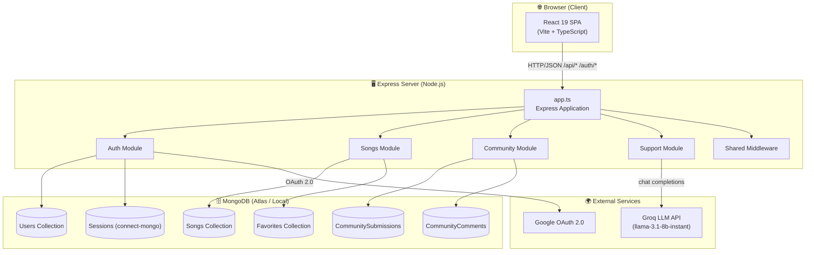

---

## 2. Package / Module Dependency Map

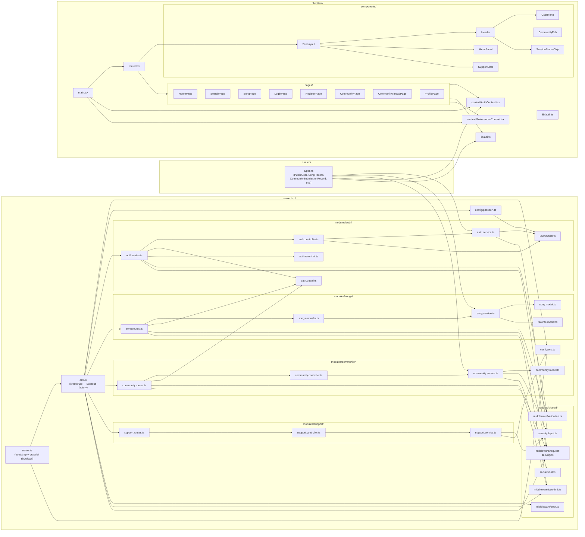

---

## 3. Class Diagram — All Modules

```mermaid
classDiagram
    %% ── Configuration ───────────────────────────────────────────────
    class EnvConfig {
        +port: number
        +isProduction: boolean
        +mongodbUrl: string
        +sessionSecret: string
        +sessionCookieName: string
        +csrfCookieName: string
        +corsAllowedOrigins: Set~string~
        +googleClientId: string
        +googleClientSecret: string
        +googleCallbackUrl: string
        +groqApiKey: string
        +groqModel: string
        +authRateLimitWindowMs: number
        +authRateLimitMax: number
        +readRateLimitMax: number
        +writeRateLimitMax: number
        +submissionRateLimitMax: number
        +commentRateLimitMax: number
        +supportChatRateLimitMax: number
    }

    class PassportConfig {
        +initializePassport() void
        -serializeUser(user, done) void
        -deserializeUser(id, done) void
    }

    %% ── Server Bootstrap ────────────────────────────────────────────
    class Bootstrap {
        +connectMongo() Promise~void~
        +bootstrap() Promise~void~
        +shutdown(signal: string) void
    }

    class AppFactory {
        +createApp() Express
        -configureHelmet() void
        -configureCors() void
        -configureSession() void
        -configurePassport() void
        -configureRoutes() void
        -configureStaticFiles() void
        -configureSpa() void
    }

    %% ── Auth Module ─────────────────────────────────────────────────
    class AuthApiRouter {
        +GET /api/me
        +PATCH /api/me/profile
        +POST /api/logout
        +POST /api/register
        +POST /api/login
    }

    class AuthOAuthRouter {
        +GET /auth/google
        +GET /auth/google/callback
        +GET /auth/google/failure
    }

    class AuthController {
        +getCurrentUser(req, res, next) Promise~void~
        +updateProfile(req, res, next) Promise~void~
        +register(req, res, next) Promise~void~
        +login(req, res, next) Promise~void~
        +logout(req, res, next) void
        +logoutJson(req, res, next) void
        +startGoogleAuth(req, res, next) void
        +finishGoogleAuth(req, res) void
        +googleFailure(req, res) void
        -createLocalSession(req, userId) Promise~void~
        -completeLogout(req, res, next, options) void
        -isSafeReturnPath(value) boolean
    }

    class AuthService {
        +validateRegistrationPayload(payload) ValidationResult
        +validateLoginPayload(payload) ValidationResult
        +validateProfileUpdatePayload(payload) ValidationResult
        +applyProfileUpdates(user, data) void
        +hashPassword(password) string
        +verifyPassword(password, storedValue) boolean
        +isLegacyScryptHash(value) boolean
        +validatePassword(password) object
        +toPublicUser(user) PublicUser
        +isUserLockedOut(user) boolean
        +incrementFailedLoginAttempts(user) void
        +resetFailedLoginAttempts(user) void
        +normalizeUsername(value) string
        +normalizeName(value) string
    }

    class AuthGuard {
        +requireAuthenticatedUser(req, res, next) void
    }

    class AuthRateLimit {
        +authWriteLimiter: RateLimitHandler
    }

    %% ── User Model ──────────────────────────────────────────────────
    class UserModel {
        +googleId: String
        +username: String
        +password: String
        +firstName: String
        +lastName: String
        +displayName: String
        +profileImage: String
        +emails: Mixed[]
        +name: Mixed
        +role: member|moderator|admin
        +about: String
        +tagline: String
        +accentKey: ProfileAccent
        +failedLoginAttempts: Number
        +lockoutUntil: Date
        +createdAt: Date
        +updatedAt: Date
    }

    %% ── Songs Module ────────────────────────────────────────────────
    class SongsRouter {
        +GET /api/songs
        +GET /api/songs/search/:query
        +GET /api/songs/favorites
        +GET /api/songs/:songId/favorite
        +POST /api/songs/:songId/favorite
        +DELETE /api/songs/:songId/favorite
        +GET /api/songs/:id
    }

    class SongController {
        +listSongsHandler(req, res, next) Promise~void~
        +searchSongsHandler(req, res, next) Promise~void~
        +getSongByIdHandler(req, res, next) Promise~void~
        +addFavoriteHandler(req, res, next) Promise~void~
        +removeFavoriteHandler(req, res, next) Promise~void~
        +getUserFavoritesHandler(req, res, next) Promise~void~
        +isSongFavoritedHandler(req, res, next) Promise~void~
    }

    class SongService {
        +listSongs() Promise~SongRecord[]~
        +searchSongs(query, limit) Promise~SongRecord[]~
        +getSongById(id) Promise~SongRecord|null~
        +addFavorite(userId, songId) Promise~void~
        +removeFavorite(userId, songId) Promise~void~
        +getUserFavorites(userId) Promise~SongRecord[]~
        +isSongFavorited(userId, songId) Promise~boolean~
        -escapeRegex(value) string
        -normalizeSearchQuery(value) string
        -parseLimit(value) number
        -toSongRecord(song) SongRecord
    }

    class SongModel {
        +Song Title: String
        +Artist: String
        +Released Date: String
        +About Song: String
        +Direct to YT: String
        +Lyric: String[]
        +albumCover: String
    }

    class FavoriteModel {
        +userId: String
        +songId: String
        +createdAt: Date
    }

    %% ── Community Module ────────────────────────────────────────────
    class CommunityRouter {
        +GET /api/community/submissions
        +GET /api/community/submissions/:submissionId
        +POST /api/community/submissions
        +POST /api/community/submissions/:submissionId/comments
    }

    class CommunityController {
        +listCommunityFeedHandler(req, res, next) Promise~void~
        +getCommunitySubmissionDetailsHandler(req, res, next) Promise~void~
        +createCommunitySubmissionHandler(req, res, next) Promise~void~
        +createCommunityCommentHandler(req, res, next) Promise~void~
    }

    class CommunityService {
        +listCommunityFeed(currentUser) Promise~CommunityFeedResponse~
        +getCommunitySubmissionDetails(id) Promise~CommunitySubmissionDetailResponse|null~
        +createCommunitySubmission(payload, user) Promise~CommunitySubmissionRecord~
        +createCommunityComment(submissionId, payload, user) Promise~CommunityCommentRecord~
        -validateSubmissionPayload(payload) object
        -validateCommentPayload(payload) object
        -getUserLabel(user) string
        -toCommunityAuthor(record) CommunityAuthor
        -toSubmissionRecord(record) CommunitySubmissionRecord
        -toCommentRecord(record) CommunityCommentRecord
    }

    class CommunitySubmissionModel {
        +title: String
        +artist: String
        +description: String
        +lyrics: String[]
        +releasedDate: String
        +youtubeUrl: String
        +status: published|removed
        +commentCount: Number
        +authorId: ObjectId
        +authorLabel: String
        +authorProfileImage: String
        +authorRole: member|moderator|admin
        +createdAt: Date
        +updatedAt: Date
    }

    class CommunityCommentModel {
        +body: String
        +status: published|removed
        +submissionId: ObjectId
        +authorId: ObjectId
        +authorLabel: String
        +authorProfileImage: String
        +authorRole: member|moderator|admin
        +createdAt: Date
        +updatedAt: Date
    }

    %% ── Support Module ──────────────────────────────────────────────
    class SupportRouter {
        +POST /api/support/chat
    }

    class SupportController {
        +supportChatHandler(req, res, next) Promise~void~
    }

    class SupportService {
        +runSupportChat(turns) Promise~SupportChatResult~
        -sanitizeTurns(raw) SupportChatTurn[]
    }

    %% ── Shared Middleware ───────────────────────────────────────────
    class ErrorMiddleware {
        +errorHandler(err, req, res, next) void
    }

    class RateLimitMiddleware {
        +apiReadLimiter: RateLimitHandler
        +apiWriteLimiter: RateLimitHandler
        +communitySubmissionLimiter: RateLimitHandler
        +communityCommentLimiter: RateLimitHandler
    }

    class RequestSecurityMiddleware {
        +ensureCsrfTokenCookie(req, res, next) void
        +rejectDangerousRequestKeys(req, res, next) void
        +requireCsrfToken(req, res, next) void
        +requireTrustedOrigin(req, res, next) void
    }

    class ValidationMiddleware {
        +validateObjectIdParam(paramName) RequestHandler
        +validateRequest(schema) RequestHandler
        +loginSchema: ZodSchema
        +registerSchema: ZodSchema
        +profileUpdateSchema: ZodSchema
    }

    class InputSecurity {
        +normalizePlainText(value, opts) string
        +normalizeLyrics(value) string[]
    }

    class UrlSecurity {
        +normalizeYouTubeUrl(value) string
    }

    %% ── Relationships ───────────────────────────────────────────────
    Bootstrap --> AppFactory : creates
    AppFactory --> AuthApiRouter : mounts /api
    AppFactory --> AuthOAuthRouter : mounts /auth
    AppFactory --> SongsRouter : mounts /api/songs
    AppFactory --> CommunityRouter : mounts /api/community
    AppFactory --> SupportRouter : mounts /api/support
    AppFactory --> PassportConfig : initializes
    AppFactory --> ErrorMiddleware : uses
    AppFactory --> RateLimitMiddleware : uses
    AppFactory --> RequestSecurityMiddleware : uses

    AuthApiRouter --> AuthController : delegates
    AuthOAuthRouter --> AuthController : delegates
    AuthApiRouter --> AuthGuard : guards
    AuthApiRouter --> AuthRateLimit : rate-limits
    AuthApiRouter --> ValidationMiddleware : validates

    AuthController --> AuthService : uses
    AuthController --> UserModel : reads/writes
    AuthService --> UserModel : reads/writes
    AuthService --> InputSecurity : uses
    PassportConfig --> UserModel : reads/writes

    SongsRouter --> SongController : delegates
    SongsRouter --> AuthGuard : guards favorites
    SongsRouter --> ValidationMiddleware : validates id param
    SongsRouter --> RequestSecurityMiddleware : secures writes
    SongController --> SongService : uses
    SongService --> SongModel : reads
    SongService --> FavoriteModel : reads/writes

    CommunityRouter --> CommunityController : delegates
    CommunityRouter --> AuthGuard : guards writes
    CommunityRouter --> RateLimitMiddleware : rate-limits
    CommunityRouter --> RequestSecurityMiddleware : secures writes
    CommunityController --> CommunityService : uses
    CommunityService --> CommunitySubmissionModel : reads/writes
    CommunityService --> CommunityCommentModel : reads/writes
    CommunityService --> InputSecurity : uses
    CommunityService --> UrlSecurity : uses

    SupportRouter --> SupportController : delegates
    SupportController --> SupportService : uses
    SupportService --> InputSecurity : uses
    SupportService --> EnvConfig : reads groqApiKey

    AuthController ..> EnvConfig : reads session/cookie names
```

---

## 4. Shared TypeScript Types (shared/types.ts)

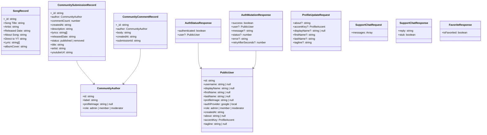

---

## 5. Client-Side Architecture

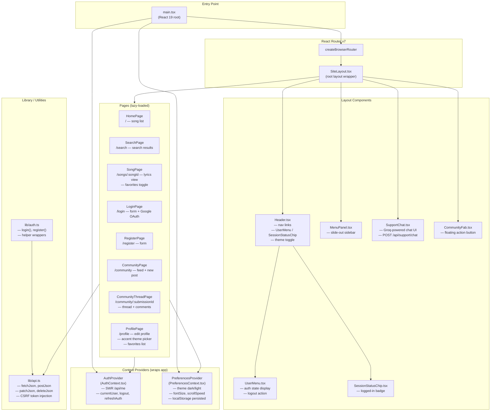

---

## 6. Route Map (Full API)

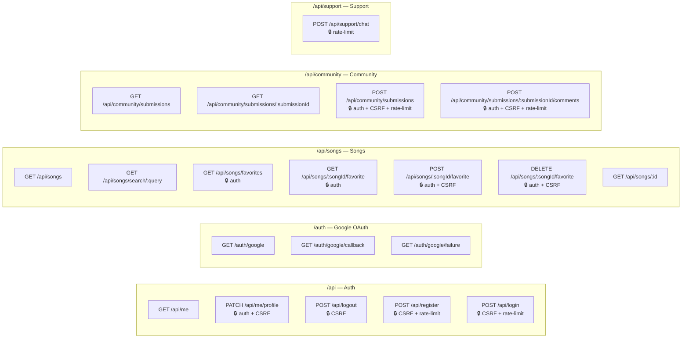

---

## 7. Sequence Diagram — User Registration Flow

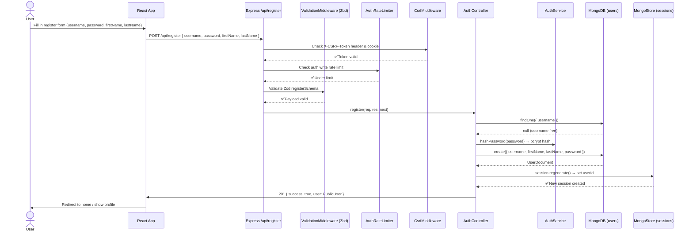

---

## 8. Sequence Diagram — Login Flow (Local Auth)

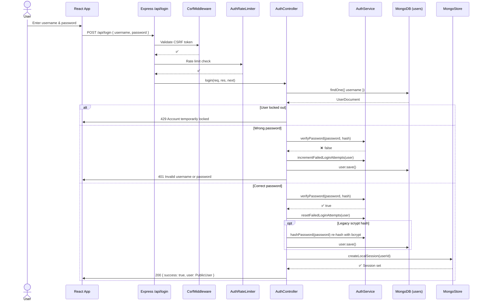

---

## 9. Sequence Diagram — Google OAuth Flow

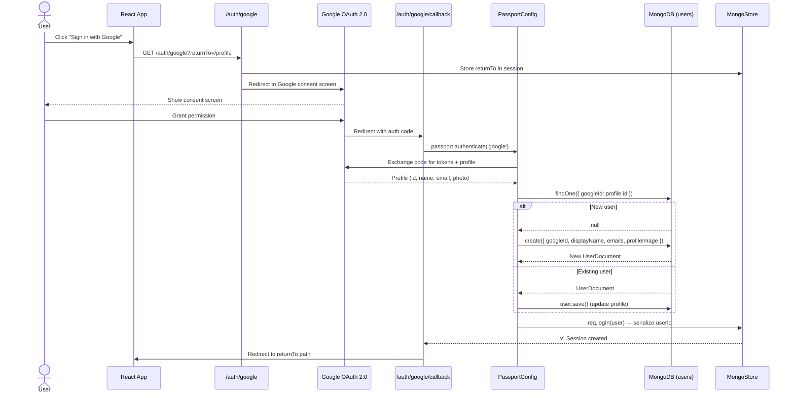

---

## 10. Sequence Diagram — Song Search Flow

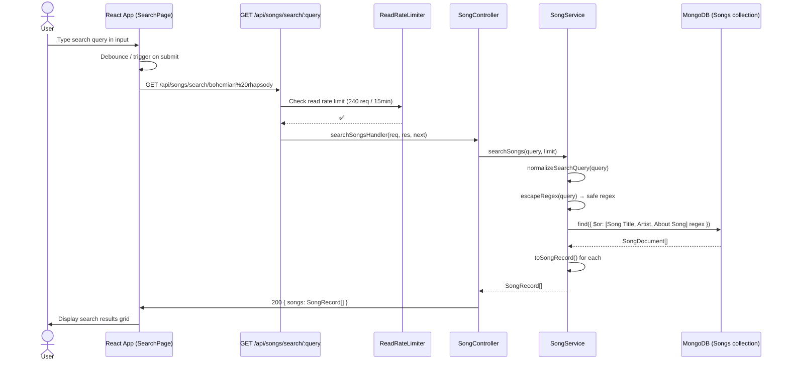

---

## 11. Sequence Diagram — Community Post & Comment Flow

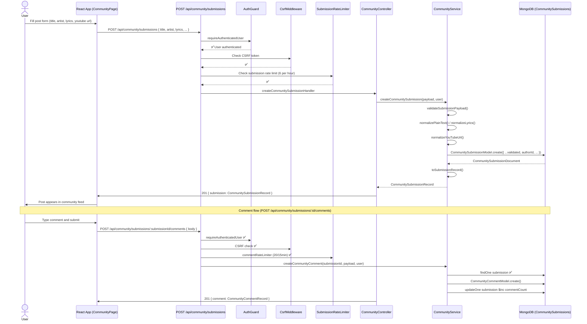

---

## 12. Sequence Diagram — AI Support Chat Flow

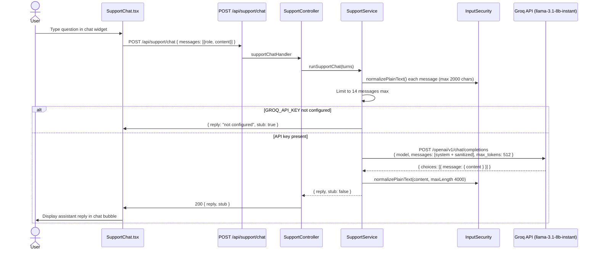

---

## 13. State Diagram — User Authentication States

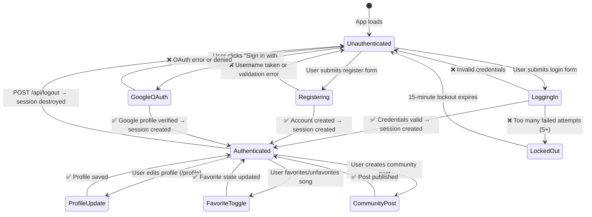

---

## 14. State Diagram — Community Submission Lifecycle

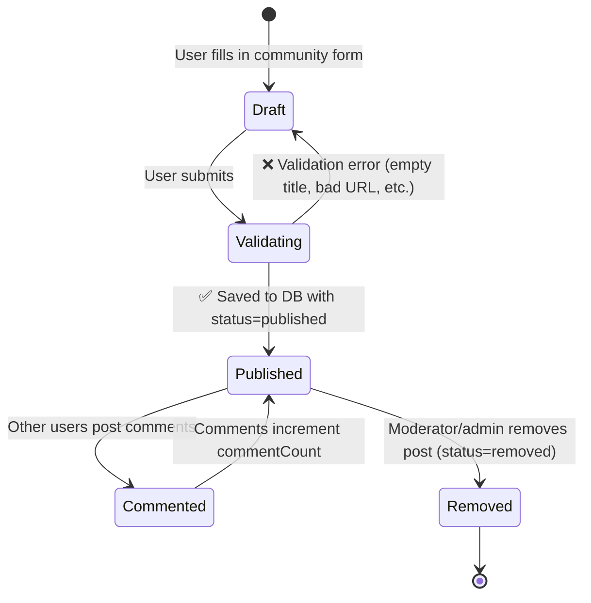

---

## 15. Security & Middleware Layer Diagram

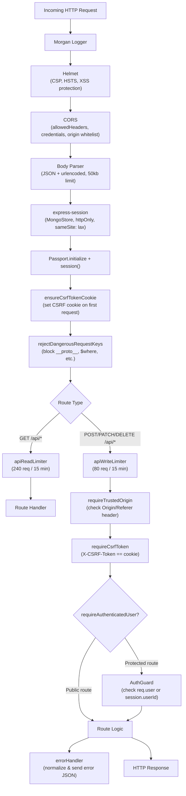

---

## Notes

- **Entry Point:** `server/src/server.ts` → `bootstrap()` connects MongoDB, then calls `createApp()`.
- **Frontend Entry:** `client/src/main.tsx` → wraps `<AuthProvider>` + `<PreferencesProvider>` around the React Router.
- **Auth Strategy:** Local (bcrypt) + Google OAuth 2.0 (passport-google-oauth20). Legacy scrypt hashes are transparently migrated to bcrypt on login.
- **Account Lockout:** 5 failed login attempts → 15-minute lockout stored in `user.lockoutUntil`.
- **CSRF Protection:** Double-submit cookie pattern — server sets `m_music.csrf` cookie; client reads it and sends as `X-CSRF-Token` header on all mutating requests.
- **Rate Limiting:** Separate limiters for auth writes, API reads, API writes, community submissions, community comments, and support chat.
- **Favorites:** Stored in a separate `Favorites` collection with a compound unique index `{ userId, songId }`.
- **Community:** Both submissions and comments carry a denormalized `authorLabel` / `authorRole` snapshot for display without additional joins.
- **AI Support Chat:** Powered by Groq (llama-3.1-8b-instant). Gracefully degrades with `stub: true` if `GROQ_API_KEY` is absent.
- **Shared Types:** `shared/types.ts` is compiled by both `tsconfig.client.json` and `tsconfig.server.json` ensuring consistent TS contracts across the full stack.
- **Session Store:** Sessions are persisted in MongoDB via `connect-mongo` with a 14-day TTL.
